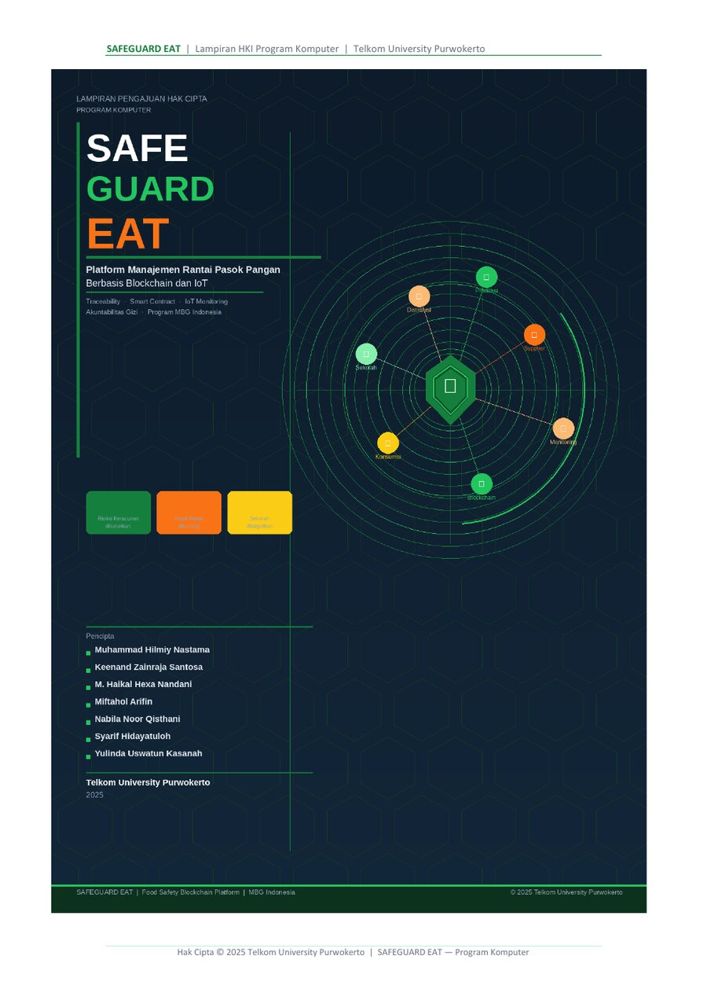
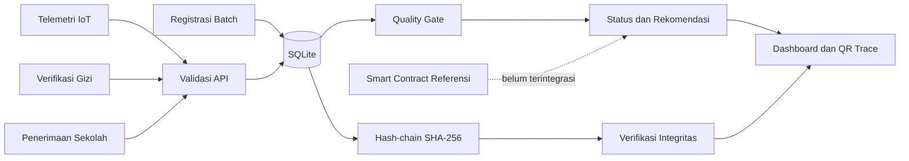

# SAFEGUARD EAT

**Platform Manajemen Rantai Pasok Pangan Berbasis Traceability Digital, Telemetri IoT, Quality Gate, dan Audit Integritas Data untuk Program Makanan Bergizi Gratis**



SAFEGUARD EAT adalah implementasi referensi program komputer untuk mencatat perjalanan batch pangan, menerima telemetri kondisi distribusi, menyimpan verifikasi gizi, mengevaluasi ketepatan pengiriman, dan menghasilkan quality gate yang dapat diaudit.

## Status implementasi

- Versi: `1.0.0`
- Status: prototipe referensi untuk lampiran Hak Cipta Program Komputer
- Data bawaan: sintetis dan anonim
- Penyimpanan: SQLite
- Lapisan integritas: hash-chain lokal berbasis SHA-256
- Smart contract: kode referensi, belum diaudit dan belum diterapkan
- IoT: endpoint penerimaan data, tanpa perangkat fisik dan kalibrasi
- Pembayaran: rekomendasi untuk tinjauan berwenang, tanpa transfer dana otomatis
- Machine learning: belum diimplementasikan karena tidak ada model, data latih, metrik, dan validasi pada lampiran

Versi repositori mengikuti versi `1.0` pada dokumen HKI. Nomor versi tidak menyatakan kesiapan produksi atau validasi lapangan.

## Batas klaim

Repositori ini tidak menyatakan bahwa sistem telah terhubung ke jaringan blockchain produksi, sensor lapangan, laboratorium, sistem pembayaran, atau basis data Program MBG. Repositori juga tidak mengklaim penurunan risiko keracunan, pengurangan food waste, atau akurasi prediksi tertentu. Klaim tersebut memerlukan data empiris dan pengujian terkontrol.

Nilai ambang bawaan berasal dari draf teknis:

- suhu distribusi maksimum `8°C`;
- keterlambatan kurang dari `30 menit`;
- pemenuhan gizi minimum `90%`.

Nilai ini hanya konfigurasi demonstrasi. Ambang operasional wajib ditetapkan berdasarkan jenis pangan, proses, standar teknis, regulasi, hasil kalibrasi, dan keputusan otoritas yang berwenang.

## Fitur yang dapat dijalankan

- Registrasi batch pangan dengan kode unik dan QR token.
- Pencatatan supplier, deskripsi pangan, tanggal produksi, dan kelengkapan dokumen.
- Penerimaan log suhu, kelembapan, waktu, label lokasi agregat, dan ID perangkat.
- Penyimpanan hasil verifikasi pemenuhan gizi dan referensi laboratorium.
- Pencatatan jadwal serta waktu penerimaan pangan.
- Quality gate deterministik untuk suhu, gizi, pengiriman, dan dokumen.
- Rekomendasi status `PASSED`, `FAILED`, atau `PENDING_DATA`.
- Jejak audit berantai dengan hash SHA-256 dan pemeriksaan integritas.
- Endpoint traceability internal dan endpoint publik berbasis QR token.
- Dashboard web untuk menjalankan data demonstrasi.
- Smart contract escrow referensi yang memisahkan pendanaan, evaluasi, release, dan refund.
- Unit test, API test, Docker, dan GitHub Actions.

## Arsitektur implementasi



## Struktur repositori

```text
SAFEGUARD-EAT/
├── backend/
│   ├── app/
│   │   ├── config.py
│   │   ├── database.py
│   │   ├── integrity.py
│   │   ├── main.py
│   │   ├── models.py
│   │   └── quality_engine.py
│   └── tests/
├── contracts/
│   └── SafeguardEatQualityGate.sol
├── frontend/
│   ├── app.js
│   ├── index.html
│   └── styles.css
├── samples/
├── docs/
├── .github/workflows/ci.yml
├── Dockerfile
└── docker-compose.yml
```

## Menjalankan aplikasi

### 1. Persyaratan

- Python 3.11 atau lebih baru
- `pip`

### 2. Siapkan lingkungan

```bash
python -m venv .venv
```

Windows:

```bash
.venv\Scripts\activate
```

Linux atau macOS:

```bash
source .venv/bin/activate
```

### 3. Instal dependensi

```bash
pip install -r requirements.txt
```

### 4. Jalankan API

```bash
uvicorn backend.app.main:app --reload
```

API tersedia di `http://127.0.0.1:8000`. Dokumentasi interaktif tersedia di `http://127.0.0.1:8000/docs`.

### 5. Jalankan dashboard

Buka terminal baru.

```bash
python -m http.server 5500 --directory frontend
```

Buka `http://127.0.0.1:5500`.

## Docker Compose

```bash
docker compose up --build
```

- API: `http://127.0.0.1:8000`
- Dashboard: `http://127.0.0.1:5500`

## Contoh alur API

Daftarkan batch:

```bash
curl -X POST http://127.0.0.1:8000/api/v1/batches \
  -H "Content-Type: application/json" \
  -d @samples/batch.json
```

Masukkan telemetri, verifikasi gizi, dan data penerimaan:

```bash
curl -X POST http://127.0.0.1:8000/api/v1/batches/SGE-DEMO-001/iot \
  -H "Content-Type: application/json" \
  -d @samples/telemetry.json

curl -X POST http://127.0.0.1:8000/api/v1/batches/SGE-DEMO-001/nutrition \
  -H "Content-Type: application/json" \
  -d @samples/nutrition.json

curl -X POST http://127.0.0.1:8000/api/v1/batches/SGE-DEMO-001/delivery \
  -H "Content-Type: application/json" \
  -d @samples/delivery.json
```

Evaluasi dan lihat jejak:

```bash
curl -X POST http://127.0.0.1:8000/api/v1/batches/SGE-DEMO-001/evaluate
curl http://127.0.0.1:8000/api/v1/batches/SGE-DEMO-001/trace
```

## Pengujian

```bash
python -m unittest discover -s backend/tests -v
```

Pengujian mencakup quality gate, batas ambang, deteksi manipulasi hash-chain, penyimpanan SQLite, traceability, QR token, dan alur API.

## Integritas data dan blockchain

Setiap kejadian batch diserialisasi secara deterministik dan dihubungkan ke hash kejadian sebelumnya. Perubahan payload lama akan membuat verifikasi gagal. Mekanisme ini membantu menunjukkan integritas urutan catatan, tetapi bukan pengganti blockchain terdistribusi.

Kode Solidity tersedia di folder `contracts/`. Kode tersebut tidak dipanggil oleh API. Penggunaan dengan dana nyata memerlukan audit keamanan, tata kelola identitas, oracle tepercaya, pengujian testnet, dan kajian hukum.

## Tata kelola dan keamanan data

- Jangan memasukkan identitas siswa, orang tua, lokasi rinci, kredensial, atau data kesehatan ke repositori publik.
- Gunakan identitas organisasi dan label lokasi agregat pada data demonstrasi.
- Pisahkan data operasional, data publik QR, dan data audit internal.
- Terapkan autentikasi, otorisasi berbasis peran, enkripsi, retensi, dan pencatatan persetujuan sebelum produksi.
- Verifikasi legalitas sumber data dan kewenangan setiap integrasi.
- Jangan menggunakan status aplikasi sebagai satu-satunya dasar pelepasan pembayaran atau keputusan keamanan pangan.

## Pencipta dan pemegang hak

Pencipta:

- Muhammad Hilmiy Nastama
- Keenand Zainraja Santosa
- M. Haikal Hexa Nandani
- Miftahol Arifin
- Nabila Noor Qisthani
- Syarif Hidayatuloh
- Yulinda Uswatun Kasanah

Pemegang Hak Cipta: **Telkom University Purwokerto**.

## Hak penggunaan

Hak cipta dilindungi. Lihat [LICENSE](LICENSE). Publikasi kode di GitHub tidak otomatis memberi izin untuk menyalin, memodifikasi, mendistribusikan, menerapkan, atau menggunakan program secara komersial.
